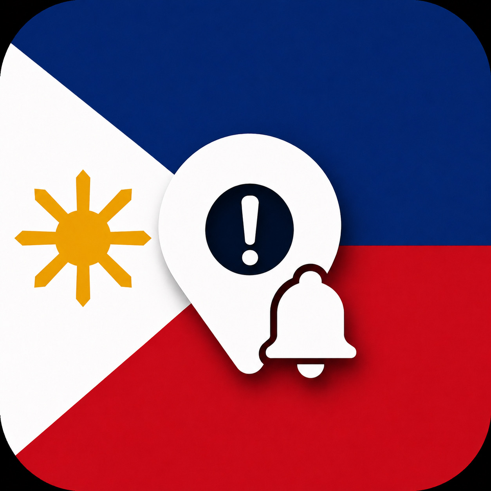

# Linkedin-Larpers

  

<strong>PhilAIert</strong> — read it again: the AI was there all along.

# Branches: 
- imira (backend)
- hamza (frontend)
- swornim (idea generation, plan formulation)

# Assessment criteria

Problem Definition (supported by evidence): 20%
Strategy/Solution: 50%
What Does Success Look Like?: 10%
Delivery and Presentation: 20%

# Pre-brief requirements

The solution will require a technology solution that addresses a particular theme, the backend and frontend will be created separately, then merged together.

# Theme

### Brief: Disaster and Emergency Management

Focus on hard-to-reach communities (culturally and linguistically), as they do not trust information provided. Some considerations:

- The information is usually text-heavy, full of jargon, and a matter of poor communication
- Alerts are not translated properly
- Response information often comes through apps; there is an assumption that people download those apps
- People who need support most don't have access to information. The groups can be minor, remote, or indigenous communities, and they should be clearly defined.
- More than one phase can be selected, but the focus should be stated
- It's not only technology that is at stake, but there are also psychological and social factors involved
- A good solution has to incorporate the same process: receiving it, understanding it, believing it, and acting on it
- Warning fatigue can lead to reduced effectiveness, as well as information overload
- *Refrain from AI-slop!*

A key consideration is the fact that being physically close is not enough and that lack of online presence can predispose these individuals to risks. 

#### Phases: 
- Prevention (avoid before it happens)
- Preparedness (prepare people)
- Response (acts taken when it does happen)
- Recovery (restore communities)

# Things to consider in approach to ideation

Think carefully where the issues are, collect evidence to ensure that the issue is significant and how this may be addressed in terms of the phases. Intervention may occur in multiple phases to mitigate impact. Address hierarchy in remote communities. Have a clearly defined community (culturally and linguistically) in the Asia Pacific Region. Trust and accessibility are very important. How will it operate, practically speaking? Think about connectivity. What alternative solutions might be considered? The solution must be based on a community need.

# Why Culturally and Linguistically diverse communities are more vulnerable

- Language barriers
- Limited social networks
- Limited local risk knowledge
- Reduced access to trusted information and services

Use evidence from real, past disasters. Context is important, so people from different backgrounds may not understand terms like "tsunami" in their native language (meaning lost through translation).

# Features

- Live map: the user accepts permissions for the app to use the user's location. Visually, the user's location around them (1 km radius) can be zoomed in and out. Landmarks/import locations get highlighted, like hospitals. Users' data may be used, like elevation to determine risk for tsunamis, to create personalised alerts and prevention plans. An open source will be used
- Determining risk: Existing data from the ABS or government websites relevant to the user's country/region can be used to determine plans. Also, the user's personal/local location can be used in addition to give personalised plans/recommendations
- Chatbot: The user can ask any questions if they are unsure about navigation or what certain terms mean
- Accessibility: Standard UI principles should be applied to account for people with disabilities and elderly people (e.g. enlarged text). The app should support several languages. Text-to-speech for the chatbot
- Risk classification: An SMS message is sent to the user, outlining the risk classification (can be traffic-lighted), with emoji symbols to denote what kind of disaster. It must be clear what phase it is referring to (as the disaster will happen soon, it is happening now). This SMS should be simple; the text should be concise and clear, free of jargon. The SMS will have a link to the app, where the app will have more detail
- Use of symbols: symbols to convey meaning

# Platform

iOS application for iPhone. SMS notifications are sent to the user containing a link into the app, where the content the SMS covered is set out in more detail.

# Filipino Dialects
Tagalog
Cebuano (Bisaya/Binisaya)
Ilocano (Ilokano)
Hiligaynon (Ilonggo)
Bikol (Central Bikol / Bicolano)
Waray (Waray-Waray / Winaray) — Eastern Visayas; the language community hit hardest by Typhoon Haiyan and the region with the lowest resilience index in the country

# Disasters - Consider emergency protocols for each disaster
Typhoons - storm surges, heavy rainfall, winds

Flash floods, triggered by other disasters

Landslides, in mountainous, deforested, or steep areas

Earthquakes - Frequent small ones, rarer large ones. 

Tsunamis

Volcanic Eruoptions

Wildfires, during dry season

Droughts

Tornadoes

# OpenStreetMAP open source maps to track user's location

https://www.openstreetmap.org/export#map=4/6.49/139.66

---

# PhilAlert — App Documentation

*Displayed as **PhilAIert** — a capital I where the second l sits, visually
identical in a sans-serif face, so "AI" is embedded in the name.* iOS app
(SwiftUI, iOS 17+), built in `ios/` (project folder retains the original
working title HandaPH).
Open `ios/HandaPH.xcodeproj` in Xcode 16+ and press ⌘R (see `ios/README.md` for
demo commands: fake GPS, SMS deep link, tests).

## Platform & stack

- **Client:** Swift 6 toolchain / SwiftUI, MVVM-lite, zero external packages
- **Maps:** Apple MapKit in the demo build; architecture specifies MapLibre Native +
  OpenStreetMap offline tiles (`HazardMapView` is the single swap point).
  **OSM open data is live today**: 32 named POIs around Tacloban (hospitals, schools
  as evacuation centres, barangay halls) extracted via the Overpass API, bundled
  offline, attributed under ODbL
- **AI:** Anthropic Claude (claude-haiku-4-5) for the assistant, retrieval-grounded;
  deterministic offline fallback. Key via `ios/Config/Secrets.local.xcconfig` (git-ignored)
- **Tests:** XCUITest smoke suite — first-run language flow, SMS deep link,
  glossary search, map personalisation + routing, offline assistant

## Features

| Feature | What it does |
| --- | --- |
| **Language-first onboarding** | First launch asks the language before anything else; each named in itself (English, Tagalog, Cebuano, Ilokano, Hiligaynon, Bikol, Waray). Switchable anytime in Settings |
| **Honest translations** | Every non-English string carries a verification state; unverified text shows an "awaiting community verification" chip. Tapping the chip opens **Suggest better wording** — readers feed the community translation loop |
| **Alerts** | Traffic-lighted severity (colour + symbol + words), explicit phase (HAPPENING NOW / EXPECTED SOON / PREPARE), numbered imperative actions, plain-language detail, text-to-speech, "near you" chips inside a 10 km relevance radius |
| **Trusted messenger** | Alerts carry a named barangay co-sign ("Confirmed by your barangay — Kap. Maria Santos"), the believe-step lever |
| **SMS → app deep link** | `handaph://a/{token}` (Universal Link `rdy.ph/a/{token}` in production) opens the exact alert the SMS summarised |
| **Live map** | User location + 1 km radius, storm-surge hazard zone overlay, tappable markers (hospitals, evacuation centres, barangay halls from OSM + curated data), legend, ODbL attribution |
| **Navigation** | Tap a marker → real walking ETA + arrival time; **Direksyon** draws the walking route in-app (Google-Maps style) with distance/ETA bar; Apple Maps handoff for turn-by-turn voice; offline degrades to a labelled straight-line estimate |
| **Personalised risk banner** | Combines active alerts, location, and household profile into one banner with a quantified index and the two most life-critical advice lines |
| **Household profile** | Elderly / young children / limited mobility / near coast or river / single-storey — stored on device only, never transmitted |
| **My Plan** | Preparedness checklist that reshapes itself: "Do now" (current hazard), "For your household" (profile-driven), "For everyone" |
| **Meanings (glossary)** | The Haiyan intervention: hazard words explained in plain language, searchable in the user's language and English, offline, with TTS — "what is a storm surge" must be answerable with the radio off |
| **Pictogram guides** | Wordless what-to-do strips per hazard (wave → run → up → strong building) on alerts and glossary pages |
| **Gabay assistant** | Floating assistant on every tab. Online: Claude, grounded ONLY on the verified corpus + the user's situation (area, personal risk, household, nearest evacuation centre), forbidden from composing warnings. Offline: deterministic retrieval — the verified entry is the answer. Voice input (speech-to-text), TTS output, learn-more glossary cards |
| **LIGTAS check-in** | One tap composes a plain SMS — "LIGTAS ✅ [name] is safe near [area]" — to saved family numbers. The receiving side needs no app, no smartphone, no data |
| **Emergency contacts** | One-tap call chips by area: 911, Red Cross 143, local DRRMO |
| **Response layer** | Red Cross / DSWD / Caritas feeding sites appear on the map only while a serious hazard is active nearby, each marker showing its named source |
| **Audio-first mode** | Alerts read themselves aloud on open — for low-literacy and elderly users |
| **Accessibility** | Dynamic Type everywhere + in-app "larger text" boost, 44pt+ targets, VoiceOver labels/values, severity never colour-alone, adjustable speech rate |

## Risk formulation

The banner's index is **R = min(1, H · P · E · V)**, taken as the maximum over all
currently relevant alerts, displayed ×100:

| Term | Meaning | Values | Source |
| --- | --- | --- | --- |
| **H** | Hazard intensity | danger 1.0 · warning 0.6 · advisory 0.3 | Official classification (PAGASA/PHIVOLCS) |
| **P** | Proximity decay | e^(−d / 10 km); region-wide alerts 0.5 | Alert centroid vs user location (on device) |
| **E** | Geographic exposure | inside mapped hazard zone ×1.5 · self-reported near-coast ×1.25 · else ×1.0 | Hazard polygons — Project NOAH inundation / DEM **elevation** layers over OSM base data (demo geometry today) |
| **V** | Household vulnerability | 1 + 0.15·elderly + 0.15·limited-mobility + 0.10·children<5 + 0.10·single-storey, cap 1.5 | Self-reported profile, on device only |

Bands: **R ≥ 0.75 danger · R ≥ 0.35 warning · else advisory.**

Worked example: storm-surge *danger* alert 2.3 km away with an elderly household
member → 1.0 × e^(−0.23) × 1.0 × 1.15 = **0.91 → index 91, DANGER**. No
vulnerability factors → 79. Standing inside the surge polygon → clamps to 100.

Why it matters: H × P is the general reasoning every warning system already has.
E × V is what only this app holds — measured geography times volunteered
demographics. The product makes the same official alert land differently on
different households: explicit, auditable, computable offline in microseconds.
Full derivation and data-source notes: `docs/architecture.md` §15.
